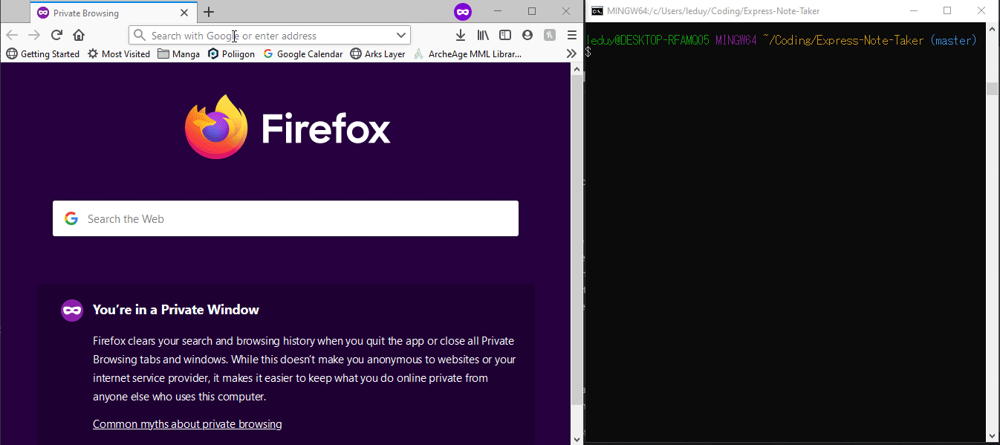

# Unit 11 Express Note Taker
Note taking application designed to write, save, and delete notes, written to and retrieved from a backend JSON file

## Example Usage

## Approach
As the front end was already created, I needed to look at connecting this to the backend. I broke down the problem into smaller objectives:
1. Start a server using Express
2. Link the HTML to get and post requests in the backend JavaScript
3. Write the user's notes to the server's JSON file with unique IDs
4. The post method needs to write the note to the JSON file for retrieval
5. The get method needs to retrieve notes from the server for viewing
6. The delete method needs to locate and delete specific notes from the server

## Challenges
My first challenge arose at the very beginning of the project: understanding pathing with Express. I needed to complete my understanding of the usage of path.join and the meaning of __dirname, which required deep reading into documentation of the package. On completion I was able to successfully link the frontend content to the server.

My second challenge was then to write the user's notes to the server. As the JSON file already exists, I used the file system package to retrieve it, parsing the file in order to write the new note to it. This challenge follows into the need to store each note with a unique ID for the delete function. I needed a means to call the selected note in order to remove it from the array. To do this, every new note saved is given an ID equal to its position in the array to start. The idea is to rewrite these IDs to match each note's new position in the array when one entry is removed.

I struggled with finding a working method for the delete function. Eventually after some debugging I found the best method to remove a note using my unique IDs was to use a filter that would return an array with every entry except the entry I was looking for. By rewriting the unique IDs of each entry after the removal, I was able to ensure that every note's ID was equal to their position in the array, thus the delete function would remove only the selected note every time.

Another challenge I had was applying the * path in my get requests. When I tried to apply the * path for the index page, I found that it would override the other unique paths I had defined. Eventually I found out that the order of get requests reflects the order of precedence, so defining the * path first would prevent the other paths from working properly! In the end, moving this path to the end of my get requests solved the issue.
